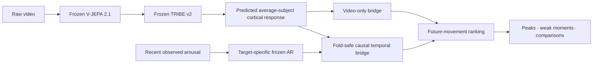

# Neural Bridge

## Learning short-horizon future-response structure from video-derived predicted cortical activity.

**Research question:** can a frozen video-to-cortical representation contain temporally aligned information about future arousal movement that survives a strong autoregressive baseline, matched false-signal controls, held-out-video evaluation, and—ultimately—the removal of response history at inference?

Neural Bridge answers **yes** on AGAIN. It converts frozen [V-JEPA 2.1](https://arxiv.org/abs/2603.14482) / [TRIBE v2](https://arxiv.org/abs/2605.04326) predictions into a causal temporal representation for ranking short-horizon future arousal movement. The upstream values are model-predicted average-subject cortical responses—not neural recordings from the people represented by the affect labels.

> **Product translation:** turn a video into a forward-looking response map—likely peaks, weak moments, and the sections most worth testing—before a full audience study is available.

| Proof point | Result | Why it matters |
| --- | --- | --- |
| Works without response labels at inference | On **299 untouched videos**: Spearman `0.178513` vs `0.100488` (**`+77.65%`**); top-5% lift `0.076608` vs `0.044852` (**`+70.80%`**); event PR-AUC `0.171062` vs `0.135230` (**`+26.50%`**) | the fixed bridge retained substantial video-derived signal with no observed arousal or response history at held-out inference |
| Continuous response ranking is confirmed | Spearman `0.260301` vs AR `0.240537` (**`+8.22%`**); top-5% lift `0.097598` vs `0.089566` (**`+8.97%`**); **`15/15`** positive fold-checkpoint groups | aligned cortical predictions added repeatable signal beyond a target-specific learned persistence model |
| Raw neuro-response features became useful | grouped event PR-AUC `0.136579` → **`0.238341`** | **`+74.51%`** on the same target; the value comes from the bridge, not raw TRIBE output |
| Evidence spans two datasets | [VEATIC](https://veatic.github.io/) + [AGAIN](https://doi.org/10.1109/TAFFC.2022.3188851) | related event-ranking evidence appears across edited video and gameplay; the label constructs differ, so this is an evidence ladder—not a claim of cross-dataset model transfer |

The `420/420` Phase 7 figure refers to **predeclared evaluation cells**, not 420 observations: `315` member cells plus `105` prespecified ensemble cells across five held-out-video folds, nine seeds, seven lanes, and three checkpoint groups. The underlying AGAIN foundation contains `995` cleaned videos and `243,575` aligned 2 Hz time rows.

The video-only model is trained with labeled development data. “Zero-label at inference” means that held-out predictions use no observed arousal, response history, teacher score, or labeled warm start; it does not mean unsupervised training.

[See the strongest concluded evidence →](results/README.md)

### The prediction task

For an eligible 2 Hz row at time `t`, the central continuous quantity is the largest future arousal increase from 2 to 5 seconds ahead:

$$
y_t = \max_{k \in \{4,\ldots,10\}} \left(a_{t+k}-a_t\right),
\qquad f_s=2\,\mathrm{Hz}.
$$

Phase 7 ranks the train-only-AR residual of this quantity:

$$
\widetilde{y}_t = y_t - \widehat f_{\mathrm{AR}}\!\left(x_t^{\mathrm{AR}}\right),
$$

where the residualizer is fixed from its declared training ownership. Event heads use a training-side threshold only,

$$
e_t = \mathbf{1}\!\left[T(y_t) \ge Q_q^{\mathrm{train}}\!\left(T(y)\right)\right].
$$

“Causal temporal” means every model input is available at prediction time; it is a temporal-information constraint, not a claim of causal identification.

### What the metrics mean—in 30 seconds

| Metric | Plain-English question | Better means |
| --- | --- | --- |
| **Spearman** | Did the model put the moments with larger true future movement ahead of the smaller ones? | closer to `1`; ordering is more correct |
| **Top-5% lift** | Do the moments the model ranks in its top 5% actually contain more true future movement? | more real movement is concentrated in the predicted peaks |
| **PR-AUC** | Can the model find rare future response events without being rewarded for guessing the common non-event class? | rare events are ranked more precisely and completely |

For ranking score $s_t$, the reported top-tail statistic is

$$
\operatorname{Lift}_{0.05}
= \mathbb{E}\!\left[y_t \mid s_t \in \operatorname{Top}_{5\%}(s)\right]
- \mathbb{E}[y_t].
$$

### What the controls mean—in 30 seconds

| Control | What it tests |
| --- | --- |
| **Frozen AR** | a strong learned persistence model using recent arousal; the exact same frozen AR sits underneath real and control residual lanes |
| **Current-row video** | whether the current frame alone explains the result, without causal temporal history |
| **No-video** | whether masks and time metadata can produce the apparent win without video content |
| **Shuffled / random features** | whether realistic-looking but misaligned or random features work just as well |
| **Diagnostics / video mean** | whether generic quality, motion, brightness, time, or static video identity explains the signal |
| **Label permutation** | whether the model still “wins” after the true training relationship is deliberately broken |

Neural Bridge is claim-bearing only when the real lane beats the appropriate strong baseline **and** these matched alternative explanations.

### How the system fits together



The AR-assisted and video-only results are separate experiments. The locked video-only lane removes `G → H` entirely at inference.

Today, you usually learn how a video affects people **after** they watch it: panels, surveys, biometrics, expensive studies, and slow feedback. Neural Bridge is building a path toward useful response intelligence before that process is complete.

This is not a generic engagement score or a renamed video embedding. Neural Bridge was built because the raw predicted neuro-response features were **not competitive on their own**.

The contribution is the bridge that made them incrementally useful under matched controls.

## The headline result

The video-only candidate was trained on 696 development videos, frozen, and then evaluated once on a prospectively locked pool of 299 videos.

At inference it received:

- cached features generated from the video;
- causal video timing and quality metadata;
- **no observed arousal**;
- **no response history**;
- **no teacher score**; and
- **no labeled warm start**.

| Locked 299-video endpoint | Neural Bridge | Strongest false-signal/no-video control | Gain | Frozen-panel wins |
| --- | ---: | ---: | ---: | ---: |
| Future-movement ranking | `0.178513` | `0.100488` | **`+77.65%`** | **`5/5`** |
| Top-5% true-movement lift | `0.076608` | `0.044852` | **`+70.80%`** | **`5/5`** |
| Future-event PR-AUC | `0.171062` | `0.135230` | **`+26.50%`** | **`5/5`** |

All three paired whole-video bootstrap lower bounds were positive. The first-30-second cold-start tier passed. The temporal model beat current-frame video, diagnostics-only, no-video, sequence-shuffled, and hard-label-permutation controls.

**Plain English:** the signal was not just “this video tends to be exciting.” The model learned useful moment-by-moment temporal structure that survived when response labels were removed from held-out inference.

[See the locked evidence, controls, and exact boundaries →](studies/again/zero-label/evidence-summary.md)

## The representation-learning result

The upstream system produces a very rich predicted cortical/fMRI representation from video. Rich does not automatically mean useful.

On the early blocked AGAIN benchmark:

| Starting point | PR-AUC | Compared with trained arousal persistence |
| --- | ---: | ---: |
| Strong trained AR baseline | `0.203622` | baseline |
| Raw predicted cortical features | `0.124315` | **`-38.95%`** |
| AR + raw cortical features | `0.167731` | **`-17.63%`** |

The raw features did not merely lose. **Naïvely adding them made a strong predictor worse.**

Neural Bridge reversed that.

On the original same-target grouped event benchmark, the system progressed from:

| System generation | PR-AUC | Change from raw cortical |
| --- | ---: | ---: |
| Raw cortical only | `0.136579` | baseline |
| Trained AR only | `0.147251` | `+0.010672` (`+7.81%`) |
| Direct AR + raw cortical | `0.170299` | `+0.033720` (`+24.69%`) |
| Fold-safe PCA bridge | `0.171648` | `+0.035069` (`+25.68%`) |
| Deterministic learned bridge | `0.230064` | `+0.093485` (**`+68.45%`**) |
| Frozen-AR residual bridge | **`0.238341`** | `+0.101762` (**`+74.51%`**) |

That final same-target bridge is:

- **`+74.51%` above raw cortical**;
- **`+39.95%` above direct AR + raw fusion**; and
- **`+38.85%` above the earlier PCA bridge**.

This is what Neural Bridge contributes. Not “we used a neuroscience model.” Not “we added more features.” It is the scientifically controlled machinery that converts a difficult, high-dimensional predicted neuro-response representation into repeatable forward-looking signal.

## From event spikes to continuous response intelligence

The programme deliberately solved the hard problem in stages.

First: **can the system find rare future response spikes?**

Then: **can it rank continuous future movement, not only binary events?**

Finally: **does useful signal survive when response history disappears at inference?**

Phase 7 answered the continuous question on grouped held-out videos:

| Phase 7 endpoint | Neural Bridge | Frozen AR | Gain over AR | Best matched control | Fold-group wins |
| --- | ---: | ---: | ---: | ---: | ---: |
| Future-movement Spearman | **`0.260301`** | `0.240537` | `+0.019764` (**`+8.22%`**) | `0.240252` | **`15/15`** |
| Top-5% movement lift | **`0.097598`** | `0.089566` | `+0.008032` (**`+8.97%`**) | `0.089709` | **`15/15`** |

The full confirmation completed `420/420` declared evaluation cells. Every held-out-video fold mean was positive. Every preregistered grouped gate passed. Checkpoint averaging itself added `+0.007797` Spearman and `+0.002502` top-5% lift over the member mean.

Compared with the original validated continuous bridge, Phase 7 improved:

- Spearman by **`+16.61%`**;
- top-5% lift by **`+23.59%`**;
- top-1% lift by **`+14.52%`**; and
- the useful top-5% margin beyond AR by **`+98.92%`**—almost exactly double.

The claim-bearing Phase 7 result is grouped held-out-video future-movement ranking and lift: held-out video IDs, `420/420` declared evaluation cells, and `15/15` positive fold-checkpoint groups. This is not a participant-exclusive or external-dataset split. Blocked-temporal and grouped-video protocols remain documented separately because they test different forms of generalization.

[Open the full Phase 7 evidence →](studies/again/phase-07-continuous/evidence-summary.md)

## What does a “future response heat map” mean?

Imagine a 90-second trailer.

Neural Bridge is not trying to claim that a future viewer’s arousal will equal exactly `0.617` at second 43. That would be false precision.

It is trying to answer the questions that actually matter:

- Which upcoming moments are likely to produce the strongest response movement?
- Are the true peaks concentrated where the model says they are?
- Where does the experience lose momentum?
- Does one edit create stronger likely response moments than another?
- Which sections deserve human testing first?

That is why ranking, top-tail lift, and rare-event PR-AUC matter. They measure whether the system finds and prioritizes the moments worth attention.

## Why the baseline is so hard to beat

Human arousal is persistent. If arousal is high now, it often remains high a moment later. A model using recent response history can therefore look surprisingly good without understanding the video at all.

Neural Bridge does not compare itself with a toy baseline.

- **AR-only** is trained for the exact target, split, fold, and seed.
- **Frozen AR** is reused unchanged under the real residual and every matched control.
- **Shuffled and random controls** preserve realistic feature shapes while destroying real alignment.
- **Video-mean and diagnostics-only controls** test whether static identity or generic video statistics explain the result.
- **Label permutation** tests whether the training relationship is real.

Phase 7 beat the AR floor and the strongest matched control in every fold-group. The locked video-only candidate beat every false-signal/no-video family on every aggregate endpoint.

That is why an `8.22%` gain over AR is more meaningful than it first appears: AR already owns most of the easy persistence signal. Neural Bridge isolates the smaller, harder, genuinely forward-looking component.

## Evidence across two very different worlds

The effect did not originate in one convenient gaming dataset.

### Original VEATIC

`124` edited affective videos spanning film, documentary, reality TV, and home video.

- strongest blocked future-event PR-AUC: **`0.2536`**;
- trained AR: `0.1969` — Neural Bridge is `+0.0567` (**`+28.80%`**);
- shuffled: `0.1840` — Neural Bridge is `+0.0696` (**`+37.83%`**);
- random: `0.1944` — Neural Bridge is `+0.0592` (**`+30.45%`**); and
- balanced event-vs-stable PR-AUC: **`0.3394`**.

VEATIC established the event signal and the importance of short causal temporal context. Its confirmed scope was future-event ranking; continuous specialization was solved later on AGAIN with richer data and stronger controls.

### AGAIN

`995` cleaned gameplay videos, `243,575` aligned 2 Hz rows, nine games, three genres, and approximately `33.8` hours in the cleaned project substrate. The source dataset contains more than 37 hours before cleaning.

AGAIN introduced stronger AR controls, fold-safe representations, residual heads, strict time separation, checkpoint stabilization, held-out-video continuous confirmation, and the locked video-only study.

Together, the two datasets support a cross-dataset event-ranking evidence ladder across related but non-identical arousal constructs. The continuous and zero-label results remain AGAIN-specific until independently confirmed elsewhere; no model-transfer result is implied.

[See the full scientific journey and decisive design lessons →](studies/README.md)

## Scientific interpretation and audit trail

The scientifically interesting result is not that a large video representation correlates with arousal. **Raw predicted cortical features were initially weaker than a strong autoregressive model. Neural Bridge extracted additional future-response signal and kept beating matched alternative explanations.**

| Review question | Claim-bearing evidence |
| --- | --- |
| **Does the bridge add signal beyond response persistence?** | Phase 7 grouped Spearman rose from frozen AR `0.240537` to **`0.260301` (`+8.22%`)**; top-5% lift rose from `0.089566` to **`0.097598` (`+8.97%`)**. |
| **Does that hold across held-out videos and retraining variation?** | Yes: the declared matrix completed **`420/420` evaluation cells** and the bridge was positive in **`15/15`** held-out-video fold-checkpoint groups. |
| **Does useful signal survive without observed arousal at inference?** | Yes: one frozen candidate passed once on 299 locked videos with no observed arousal, response history, teacher score, or labeled warm start at inference. Training was supervised. |
| **Could static video identity, timing, quality, or accidental alignment explain it?** | The real lane beat current-row video, no-video, diagnostics-only, shuffled, random, video-mean, and label-permutation controls under their declared comparisons. |
| **Can the claims be audited rather than merely trusted?** | Compact closures recompute from tracked CSV/JSON; representative checkpoints replay published rows; large artifacts are hash-registered; the phase record preserves every decisive selection and control result. |

The evaluation discipline is deliberately strict:

- target-specific AR is trained separately, then frozen identically beneath real and residual-control lanes;
- PCA, scalers, thresholds, AR, and heads are fitted only within their declared fold ownership;
- blocked-temporal and held-out-video protocols remain separate because they test different generalization questions;
- candidates and any checkpoint ensembles are declared before confirmation; and
- discovery, candidate selection, confirmation, and locked closure cannot silently exchange roles.

The analysis does not treat the `243,575` autocorrelated time rows as independent replications. Phase 7 earns its consistency claim across five held-out-video folds and three prespecified checkpoint groups. The locked video-only study goes further: its uncertainty calculation resamples whole videos (`2,000` bootstrap replicates), and the one-sided 95% lower bounds for the gain over the strongest control are `+0.060679` Spearman, `+0.018774` top-5% lift, and `+0.023546` event PR-AUC—all above zero.

For a manuscript, the clean next statistical additions are video-clustered intervals for Phase 7 and a participant-grouped sensitivity analysis where source identities permit it. Those strengthen inference around an already confirmed effect; they do not replace the existing held-out-video and locked-video results.

[Read the methods and reproduce the evidence →](docs/README.md) · [Audit the complete study journey →](studies/README.md)

## Upstream data and model lineage

| Component | Role here | Scientific boundary |
| --- | --- | --- |
| [AGAIN](https://doi.org/10.1109/TAFFC.2022.3188851) | primary large-scale benchmark; first-person continuous arousal annotations from gameplay | Neural Bridge uses the cleaned 995-video subset; grouped folds hold out video IDs, not necessarily participants |
| [VEATIC](https://openaccess.thecvf.com/content/WACV2024/html/Ren_VEATIC_Video-Based_Emotion_and_Affect_Tracking_in_Context_Dataset_WACV_2024_paper.html) | historical 124-video event-ranking foundation | ratings concern the selected character's perceived affect; this is related evidence, not the same label construct as AGAIN |
| [V-JEPA 2.1](https://arxiv.org/abs/2603.14482) | frozen ViT-G dense video representation in the AGAIN feature foundation | upstream representation; Neural Bridge does not claim to train or improve V-JEPA itself |
| [TRIBE v2](https://arxiv.org/abs/2605.04326) | frozen model mapping naturalistic stimuli to predicted average-subject fMRI response | outputs are in-silico predictions on a cortical surface, not measurements from AGAIN or VEATIC participants |

## Product translation

The research points toward a practical **response-intelligence layer between raw video and expensive audience testing**. A future product can turn video into response heat maps, likely peak and weak-moment detection, edit comparisons, cold-start diagnostics, confidence bands, and a principled shortlist of segments to test with people.

The core asset is not access to an upstream model. It is the accumulated machinery that made a difficult representation useful: causal temporal learning, target-specific baselines, matched controls, fold-safe fitting, prospective candidate freezes, and executable evidence. End-to-end raw-video runtime, cost, calibration, external transfer, and prospective customer studies are the next commercial proof points.

[Inspect the concluded scorecard and exact values →](results/README.md)

## Honest boundaries

Neural Bridge does **not** currently claim:

- mind reading;
- individual profiling;
- medical or diagnostic inference;
- universal emotion recognition;
- exact second-by-second future trajectories;
- guaranteed audience or commercial outcomes; or
- production validity from arbitrary raw client video.

The locked result is zero-label **at inference**, not label-free training. The upstream features are video-generated predictions, not direct neural recordings. Phase 7’s confirmed claim is grouped held-out-video ranking and top-tail lift on AGAIN.

Those boundaries make the result defensible. They do not make it small.

## Evidence map

| Go directly to | What is there |
| --- | --- |
| [Concluded results](results/README.md) | the compact scorecard with actual values and percentage gains |
| [Methods and reproducibility](docs/README.md) | data ownership, controls, fitting rules, verification, and hardware support |
| [Complete study journey](studies/README.md) | the evidence chain from dense data foundation through locked zero-label confirmation |
| [Phase 7 grouped closure](studies/again/phase-07-continuous/grouped-confirmation/) | the `420/420` evaluation-cell, `15/15` fold-checkpoint-group report and machine evidence |
| [Locked zero-label closure](studies/again/zero-label/locked-confirmation/) | the prospectively locked 299-video report, audits, controls, and machine verdict |
| [`src/neural_bridge/`](src/neural_bridge/) | the single current CPU/CUDA/MLX-capable implementation |
| [`registry/artifacts/`](registry/artifacts/) | hashes and provenance for heavy external artifacts |

## Run the tracked evidence

```bash
uv sync --group dev
uv run ruff check src tests
uv run ty check
uv run pytest -q

uv run python -m neural_bridge.again verify-evidence phase7-grouped \
  --root studies/again/phase-07-continuous/grouped-confirmation
uv run python -m neural_bridge.zero_label \
  studies/again/zero-label/locked-confirmation
```

These evidence checks run on ordinary CPU hardware. Shared model training supports PyTorch on CPU/CUDA and MLX on Apple silicon. No Rust Token Killer installation is required.
