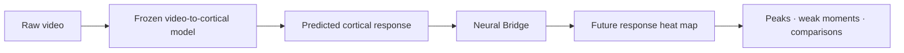

# Neural Bridge

## Predict the moments that will move an audience—before the video ships.

**Neural Bridge turns video into a forward-looking map of likely human-arousal movement: the peaks, weak moments, and sections most worth testing.**

| Proof point | Result | Why it matters |
| --- | --- | --- |
| Works without response labels at inference | **299 untouched videos**, `5/5` panels, gains of **`+77.65%`**, **`+70.80%`**, and **`+26.50%`** over the strongest controls | the bridge can operate from video-derived features alone on held-out inference |
| Continuous response ranking is confirmed | **`420/420`** rows and **`15/15`** positive fold-groups versus strong AR and matched controls | the result is repeatable across unseen videos, seeds, and checkpoint groups |
| Raw neuro-response features became useful | grouped event PR-AUC `0.136579` → **`0.238341`** | **`+74.51%`** on the same target; the value comes from the bridge, not raw TRIBE output |
| Evidence spans two domains | original VEATIC + large-scale AGAIN | the event signal appears in edited affective video and gameplay, not one convenient dataset |

> **The short version:** raw predicted cortical features initially lost badly to a strong persistence model. Neural Bridge turned them into signal that beat persistence and false-signal controls—then preserved substantial signal with response history removed entirely from inference.

[See the strongest concluded evidence →](results/README.md)

### What the metrics mean—in 30 seconds

| Metric | Plain-English question | Better means |
| --- | --- | --- |
| **Spearman** | Did the model put the moments with larger true future movement ahead of the smaller ones? | closer to `1`; ordering is more correct |
| **Top-5% lift** | Do the moments the model ranks in its top 5% actually contain more true future movement? | more real movement is concentrated in the predicted peaks |
| **PR-AUC** | Can the model find rare future response events without being rewarded for guessing the common non-event class? | rare events are ranked more precisely and completely |

### What the controls mean—in 30 seconds

| Control | What it tests |
| --- | --- |
| **Frozen AR** | a strong learned persistence model using recent arousal; the exact same frozen AR sits underneath real and control residual lanes |
| **Current-row video** | whether the current frame alone explains the result, without causal temporal history |
| **No-video** | whether masks and time metadata can produce the apparent win without video content |
| **Shuffled / random features** | whether realistic-looking but misaligned or random features work just as well |
| **Diagnostics / video mean** | whether generic quality, motion, brightness, time, or static video identity explains the signal |
| **Label permutation** | whether the model still “wins” after the true training relationship is deliberately broken |

Neural Bridge is claim-bearing only when the real lane beats the appropriate strong baseline **and** these matched alternative explanations.

### How the system fits together



Today, you usually learn how a video affects people **after** they watch it: panels, surveys, biometrics, expensive studies, and slow feedback. Neural Bridge is building a path toward useful response intelligence before that process is complete.

This is not a generic engagement score and it is not a prettier wrapper around a video embedding. Neural Bridge was built because the raw predicted neuro-response features were **not useful enough on their own**.

The breakthrough is the bridge that made them useful.

## The headline result

The video-only candidate was trained on 696 development videos, frozen, and then evaluated once on a prospectively locked pool of 299 videos.

At inference it received:

- cached features generated from the video;
- causal video timing and quality metadata;
- **no observed arousal**;
- **no response history**;
- **no teacher score**; and
- **no labeled warm start**.

| Locked 299-video endpoint | Neural Bridge | Strongest false-signal/no-video control | Gain | Frozen-panel wins |
| --- | ---: | ---: | ---: | ---: |
| Future-movement ranking | `0.178513` | `0.100488` | **`+77.65%`** | **`5/5`** |
| Top-5% true-movement lift | `0.076608` | `0.044852` | **`+70.80%`** | **`5/5`** |
| Future-event PR-AUC | `0.171062` | `0.135230` | **`+26.50%`** | **`5/5`** |

All three paired whole-video bootstrap lower bounds were positive. The first-30-second cold-start tier passed. The temporal model beat current-frame video, diagnostics-only, no-video, sequence-shuffled, and hard-label-permutation controls.

**Plain English:** the signal was not just “this video tends to be exciting.” The model learned useful moment-by-moment temporal structure that survived when response labels were removed from held-out inference.

[See the locked evidence, controls, and exact boundaries →](studies/again/zero-label/evidence-summary.md)

## Why this is a real breakthrough

The upstream system produces a very rich predicted cortical/fMRI representation from video. Rich does not automatically mean useful.

On the early blocked AGAIN benchmark:

| Starting point | PR-AUC | Compared with trained arousal persistence |
| --- | ---: | ---: |
| Strong trained AR baseline | `0.203622` | baseline |
| Raw predicted cortical features | `0.124315` | **`-38.95%`** |
| AR + raw cortical features | `0.167731` | **`-17.63%`** |

The raw features did not merely lose. **Naïvely adding them made a strong predictor worse.**

Neural Bridge reversed that.

On the original same-target grouped event benchmark, the system progressed from:

| System generation | PR-AUC | Change from raw cortical |
| --- | ---: | ---: |
| Raw cortical only | `0.136579` | baseline |
| Trained AR only | `0.147251` | `+0.010672` (`+7.81%`) |
| Direct AR + raw cortical | `0.170299` | `+0.033720` (`+24.69%`) |
| Fold-safe PCA bridge | `0.171648` | `+0.035069` (`+25.68%`) |
| Deterministic learned bridge | `0.230064` | `+0.093485` (**`+68.45%`**) |
| Frozen-AR residual bridge | **`0.238341`** | `+0.101762` (**`+74.51%`**) |

That final same-target bridge is:

- **`+74.51%` above raw cortical**;
- **`+39.95%` above direct AR + raw fusion**; and
- **`+38.85%` above the earlier PCA bridge**.

This is what Neural Bridge contributes. Not “we used a neuroscience model.” Not “we added more features.” It is the scientifically controlled machinery that converts a difficult, high-dimensional predicted neuro-response representation into repeatable forward-looking signal.

## From event spikes to continuous response intelligence

The programme deliberately solved the hard problem in stages.

First: **can the system find rare future response spikes?**

Then: **can it rank continuous future movement, not only binary events?**

Finally: **does useful signal survive when response history disappears at inference?**

Phase 7 answered the continuous question on grouped held-out videos:

| Phase 7 endpoint | Neural Bridge | Frozen AR | Gain over AR | Best matched control | Fold-group wins |
| --- | ---: | ---: | ---: | ---: | ---: |
| Future-movement Spearman | **`0.260301`** | `0.240537` | `+0.019764` (**`+8.22%`**) | `0.240252` | **`15/15`** |
| Top-5% movement lift | **`0.097598`** | `0.089566` | `+0.008032` (**`+8.97%`**) | `0.089709` | **`15/15`** |

The full confirmation completed `420/420` declared rows. Every held-out-video fold mean was positive. Every preregistered grouped gate passed. Checkpoint averaging itself added `+0.007797` Spearman and `+0.002502` top-5% lift over the member mean.

Compared with the original validated continuous bridge, Phase 7 improved:

- Spearman by **`+16.61%`**;
- top-5% lift by **`+23.59%`**;
- top-1% lift by **`+14.52%`**; and
- the useful top-5% margin beyond AR by **`+98.92%`**—almost exactly double.

The claim-bearing Phase 7 result is grouped held-out-video future-movement ranking and lift: unseen videos, `420/420` declared rows, and `15/15` positive fold-groups. Blocked-temporal and grouped-video protocols remain documented separately because they test different forms of generalization.

[Open the full Phase 7 evidence →](studies/again/phase-07-continuous/evidence-summary.md)

## What does a “future response heat map” mean?

Imagine a 90-second trailer.

Neural Bridge is not trying to claim that a future viewer’s arousal will equal exactly `0.617` at second 43. That would be false precision.

It is trying to answer the questions that actually matter:

- Which upcoming moments are likely to produce the strongest response movement?
- Are the true peaks concentrated where the model says they are?
- Where does the experience lose momentum?
- Does one edit create stronger likely response moments than another?
- Which sections deserve human testing first?

That is why ranking, top-tail lift, and rare-event PR-AUC matter. They measure whether the system finds and prioritizes the moments worth attention.

## Why the baseline is so hard to beat

Human arousal is persistent. If arousal is high now, it often remains high a moment later. A model using recent response history can therefore look surprisingly good without understanding the video at all.

Neural Bridge does not compare itself with a toy baseline.

- **AR-only** is trained for the exact target, split, fold, and seed.
- **Frozen AR** is reused unchanged under the real residual and every matched control.
- **Shuffled and random controls** preserve realistic feature shapes while destroying real alignment.
- **Video-mean and diagnostics-only controls** test whether static identity or generic video statistics explain the result.
- **Label permutation** tests whether the training relationship is real.

Phase 7 beat the AR floor and the strongest matched control in every fold-group. The locked video-only candidate beat every false-signal/no-video family on every aggregate endpoint.

That is why an `8.22%` gain over AR is more meaningful than it first appears: AR already owns most of the easy persistence signal. Neural Bridge isolates the smaller, harder, genuinely forward-looking component.

## Evidence across two very different worlds

The effect did not originate in one convenient gaming dataset.

### Original VEATIC

`124` edited affective videos spanning film, documentary, reality TV, and home video.

- strongest blocked future-event PR-AUC: **`0.2536`**;
- trained AR: `0.1969` — Neural Bridge is `+0.0567` (**`+28.80%`**);
- shuffled: `0.1840` — Neural Bridge is `+0.0696` (**`+37.83%`**);
- random: `0.1944` — Neural Bridge is `+0.0592` (**`+30.45%`**); and
- balanced event-vs-stable PR-AUC: **`0.3394`**.

VEATIC established the event signal and the importance of short causal temporal context. Its confirmed scope was future-event ranking; continuous specialization was solved later on AGAIN with richer data and stronger controls.

### AGAIN

`995` cleaned gameplay videos, `243,575` aligned 2 Hz rows, nine games, three genres, and more than 37 hours of annotated material.

AGAIN introduced stronger AR controls, fold-safe representations, residual heads, strict time separation, checkpoint stabilization, held-out-video continuous confirmation, and the locked video-only study.

Together, the two datasets support a real cross-domain event-ranking story. The continuous and zero-label results remain AGAIN-specific until independently confirmed elsewhere.

[See the full scientific journey and decisive design lessons →](studies/README.md)

## What this could become

Neural Bridge is being built as **Service as Software for neuro-response video intelligence**.

The product direction is simple: upload a video and receive a response-readiness layer that helps people decide what to test, revise, compare, or ship.

Potential outputs include:

- a predicted future-response heat map;
- likely peak and weak-moment detection;
- segment-level response diagnostics;
- variant and edit comparisons;
- cold-start response-readiness reports;
- uncertainty and confidence bands; and
- prioritization for expensive human testing.

For a creative team, this could mean faster iteration before a campaign launches. For researchers, it is a controlled way to test whether predicted neuro-response representations carry forward-looking behavioral signal. For investors, it is the foundation of a scalable intelligence layer between raw video models and real human-response decisions.

The research result is real. The product layer is still being validated. End-to-end raw-video execution, latency, external transfer, calibration, and prospective client outcomes are the next commercial proof points.

## Why a scientific reviewer should take it seriously

- **The complete development record is preserved.** Every decisive baseline, control screen, target change, tuning branch, and ensemble decision remains auditable in its phase package.
- **Controls are matched.** Real and false-signal residual lanes share the exact frozen AR underneath them.
- **Fitting is fold-safe.** PCA, scalers, thresholds, AR, and heads are fitted only inside their declared training ownership.
- **Validation schemes are not mixed.** Blocked time and held-out-video evidence remain separate.
- **Candidates are frozen before confirmation.** Locked results are not used to select their own models.
- **Heavy artifacts are hash-registered.** Checkpoints and large caches remain outside Git without disappearing from provenance.
- **The evidence is executable.** Compact closures recompute from tracked CSV/JSON, and representative checkpoints replay against published rows.

[Read the methods and reproduce the evidence →](docs/README.md)

## Honest boundaries

Neural Bridge does **not** currently claim:

- mind reading;
- individual profiling;
- medical or diagnostic inference;
- universal emotion recognition;
- exact second-by-second future trajectories;
- guaranteed audience or commercial outcomes; or
- production validity from arbitrary raw client video.

The locked result is zero-label **at inference**, not label-free training. The upstream features are video-generated predictions, not direct neural recordings. Phase 7’s confirmed claim is grouped held-out-video ranking and top-tail lift on AGAIN.

Those boundaries make the result defensible. They do not make it small.

## Start exploring

| If you are… | Start here |
| --- | --- |
| A professor or scientific reviewer | [Methods, controls, and reproducibility](docs/README.md) |
| An investor or product partner | [The strongest concluded results](results/README.md) |
| Auditing the evidence trail | [The complete study journey](studies/README.md) |
| Reproducing Phase 7 | [Grouped report and machine evidence](studies/again/phase-07-continuous/grouped-confirmation/) |
| Reviewing label-free-at-inference evidence | [Locked zero-label confirmation](studies/again/zero-label/locked-confirmation/) |
| Inspecting the implementation | [`src/neural_bridge/`](src/neural_bridge/) |
| Checking heavy-artifact provenance | [`registry/artifacts/`](registry/artifacts/) |

## Run the tracked evidence

```bash
uv sync --group dev
uv run ruff check src tests
uv run ty check
uv run pytest -q

uv run python -m neural_bridge.again verify-evidence phase7-grouped \
  --root studies/again/phase-07-continuous/grouped-confirmation
uv run python -m neural_bridge.zero_label \
  studies/again/zero-label/locked-confirmation
```

These evidence checks run on ordinary CPU hardware. Shared model training supports PyTorch on CPU/CUDA and MLX on Apple silicon. No Rust Token Killer installation is required.
