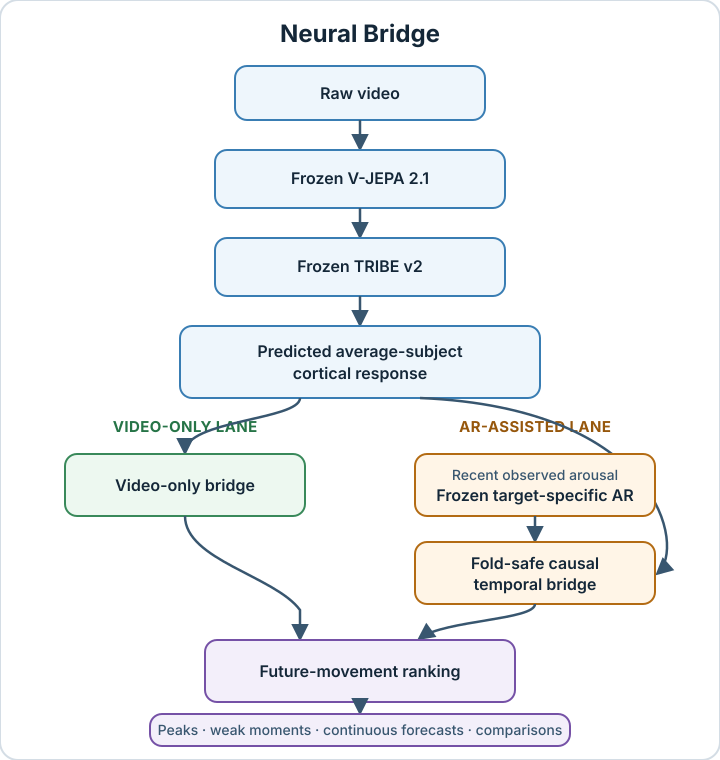

# Neural Bridge

## Turning video-derived predicted cortical activity into forward-looking response intelligence.

**Research question:** can a frozen video-to-cortical representation reveal future response spikes and continuous arousal movement beyond strong autoregressive baselines, matched false-signal controls, and held-out-video evaluation—and can useful signal survive with no response history at inference?

Neural Bridge answers **yes** across a programme that began with an event/spike breakthrough on [VEATIC](https://openaccess.thecvf.com/content/WACV2024/html/Ren_VEATIC_Video-Based_Emotion_and_Affect_Tracking_in_Context_Dataset_WACV_2024_paper.html) and matured on [AGAIN](https://doi.org/10.1109/TAFFC.2022.3188851). It first found rare future response events, then rebuilt and confirmed the event system under stronger controls, extended the bridge to continuous movement ranking, and finally retained substantial signal with no response labels or history at inference.

The bridge converts frozen [V-JEPA 2.1](https://arxiv.org/abs/2603.14482) / [TRIBE v2](https://arxiv.org/abs/2605.04326) predictions into causally constrained temporal representations. The upstream values are model-predicted average-subject cortical responses—not neural recordings from the people represented by the affect labels.

## The end goal: one cumulative production generalist

Neural Bridge is not ultimately a collection of unrelated dataset models. The programme is building one increasingly capable video-response system that accumulates complementary abilities from VEATIC, AGAIN, and future datasets, then applies those abilities to unseen client video.

The intended production path is:

```text
unseen client video
    → V-JEPA 2.1 inside the TRIBE v2 encoding stack
    → dense predicted cortical-response sequence
    → the combined Neural Bridge temporal model
    → future spike, continuous movement, valence, peak/weak-moment, and heat-map outputs
```

### V-JEPA 2.1 and TRIBE v2 are one upstream stack

V-JEPA 2.1 and TRIBE v2 are not two competing Neural Bridge models or two independent production inputs. V-JEPA 2.1 is the video encoder used inside the TRIBE v2 pipeline; TRIBE v2 maps that encoded video information into predicted average-subject cortical activity. For VEATIC 2.1, the expensive V-JEPA 2.1 pass was run once on H100 hardware and cached, then TRIBE v2 was run over those cached encoder outputs locally. That avoided paying to re-encode the same 124 videos while preserving the intended upstream stack.

The active VEATIC Neural Bridge input is the complete collection of 124 per-video TRIBE payloads under `/Volumes/onn. Drive/Neural Bridge Artifacts/features/veatic-2.1/tribe-v2/veatic 2.1 raw cortical predictions/per_video`. Each payload contributes its `cortical_prediction` array on the exact 2 Hz row grid; there is no single pooled or privileged prediction file. Matching row identity, label, and interpolation provenance comes from the per-video `rows.csv` files under `/Volumes/onn. Drive/Neural Bridge Artifacts/features/veatic-2.1/vjepa-2.1/veatic 2.1 v jepa 2.1 stuff`. V-JEPA hidden-state NPZ files are upstream-only and are not Neural Bridge inputs.

Neural Bridge begins after this frozen upstream stack. Raw TRIBE output is rich but is not expected to solve the product task by itself. AGAIN demonstrated the central point: raw predicted cortical features could lose to a strong response-history baseline, while the learned Neural Bridge temporal and residual machinery exposed useful forward-looking signal.

### Why multiple datasets exist

The datasets are complementary training and proving environments for the eventual generalist:

| Source | Domain and capability contribution | Role in the final system |
| --- | --- | --- |
| **AGAIN** | `995` cleaned gameplay videos with dense first-person arousal; cracked controlled event/spike ranking, continuous future-movement ranking, and later video-only inference | teaches the bridge robust gameplay dynamics, response movement, event stabilization, residual learning, controls, and zero-label-at-inference methods |
| **VEATIC 2.1** | the same `124` VEATIC film, television, documentary, and contextual-affect videos rebuilt on the stronger dense 2 Hz V-JEPA 2.1/TRIBE v2 substrate; includes both arousal and valence | adds edited and narrative video structure, perceived contextual affect, valence, and domain coverage that AGAIN cannot provide |
| **Future datasets** | new content types, populations, labels, and response conditions | extend coverage and reduce dependence on the quirks of any one benchmark before production claims are made |

Each dataset must first earn its own scientifically valid capabilities. VEATIC 2.1 therefore does **not** inherit AGAIN-fitted PCA, heads, thresholds, checkpoints, gates, or numerical choices. It inherits the lessons that worked—dense alignment, strong fresh baselines, fold ownership, learned temporal residuals, matched controls, stability testing, no-harm, and prospective confirmation—then calculates its own targets, widths, models, and training settings from VEATIC evidence.

After dataset-specific abilities are discovered and confirmed, they become inputs to the eventual combined production model. The exact consolidation architecture is itself an empirical question, but the product contract is fixed: one system should retain the useful abilities learned across gameplay, film, television, contextual video, advertisements, and future domains rather than selecting a different research model manually for every client.

### Labels help training; client inference must work from video

The programme deliberately cracks difficult abilities with labels before attempting to remove label dependence. Labels are used to define targets, train supervised heads, compare checkpoints, and determine whether video adds meaningful information beyond strong baselines. PCA remains label-blind because its job is fold-owned compression, not supervised target selection.

For label-assisted spike and continuous experiments, a freshly fitted autoregressive model is a comparator and may serve as the frozen base of a bounded residual candidate. It is not assumed to be available when a client uploads an advertisement. The later zero-label stage asks the production question: how much of the learned response intelligence can operate from video-derived features without observed client response labels, response history, teacher scores, or a labeled warm start?

“Zero-label” therefore means **zero labels at inference**, not unsupervised training. The final production model is expected to learn from labeled development datasets and then operate on unseen client video through the same upstream encoding stack.

### What the product should and should not predict

Exact human-response values are neither realistic nor necessary. People and audiences vary, and no model can promise a precise second-by-second reaction for every viewer. Neural Bridge instead targets useful, transferable response structure:

- relative ranking of likely future response movement;
- rare spike and event likelihood;
- high-value peaks and weak moments;
- continuous arousal movement and top-tail concentration;
- valence structure once VEATIC 2.1 earns it;
- heat maps and segment comparisons that guide edits and testing; and
- calibrated confidence and no-harm behavior when the learned bridge cannot improve on its validated fallback.

The engineering objective is maximum accuracy, performance, robustness, and domain coverage in the most efficient defensible implementation. Efficiency is not permission to discard useful signal, reduce model capability, or skip necessary integration work.

## What we are doing now: the VEATIC 2.1 rebuild

VEATIC 2.1 is not a new dataset and is not the Original VEATIC model renamed. It is a fresh Neural Bridge rebuild over the same 124 VEATIC videos using the denser, stronger 2 Hz V-JEPA 2.1/TRIBE v2 substrate and the scientific lessons earned from Original VEATIC and AGAIN.

The current position is immediately after the genuinely fresh Phase 01 target substrate:

- Phase 00 independently passed all 27 mandatory controls over all 124 per-video payloads and
  all 20,657 exact 2 Hz rows;
- Phase 01 independently passed all 28 mandatory controls, preserving exact label,
  interpolation, TRIBE row-time, and quality metadata for every row;
- Phase 01 registered all 231 VEATIC-supported future-window hypotheses: all 21 no-washout
  candidates are active for Phase 02 and all 210 washout candidates remain prospective only;
- no target, split, AR family, representation, projection width, temporal context, head, optimizer, seed, checkpoint, control result, or winner is selected;
- the only authorized action is the comprehensive fresh Phase 02 target-specific AR benchmark
  over all 21 active no-washout candidates;
- quality flags remain attached metadata and do not silently delete rows; and
- no cortical benchmark, PCA, learned model, or later phase begins until Phase 02 exhaustively
  establishes and seals the VEATIC AR floor under separate grouped-video and blocked-forward
  protocols.

After Phase 00, every phase and subphase must preregister a broad VEATIC-specific candidate registry, complete matched controls, staged training and pruning rules, convergence/undertraining checks, fresh-seed expansion, a full ledger of successful and failed runs, and a search-sufficiency gate. A convenient baseline, one projection, one head, one optimizer, one budget, or one seed cannot establish either a win or a failure.

The scientific order from there is fixed:

1. audit and seal the complete 124-video, 20,657-row 2 Hz substrate in fresh Phase 00;
2. derive the arousal-spike target family from VEATIC labels without reading cortical results;
3. establish the strongest defensible fresh VEATIC AR floor through a comprehensive search;
4. benchmark raw cortical signal and controls over every eligible per-video row;
5. comprehensively search fold-owned projections, widths, temporal representations, and controls;
6. comprehensively search learned head, residual/fusion, optimizer, budget, and checkpoint families;
7. confirm and stabilize a controlled spike winner before opening continuous arousal;
8. repeat the full specialized method for continuous arousal;
9. crack valence through its own VEATIC-specific target and experiment programme; and
10. only after all supervised abilities are established, develop the genuine video-only, zero-label-at-inference lane and integrate confirmed VEATIC and AGAIN abilities into the broader production generalist.

The active command, exact artifact paths, and next executable gate live in [`internal/handoff/CURRENT_STATE.md`](internal/handoff/CURRENT_STATE.md). That handoff records current execution state; this README records the stable product and programme model.

### Two peer-reviewed proving grounds

| Dataset | Why it is formidable | Neural Bridge scope |
| --- | --- | --- |
| **[VEATIC · WACV 2024](https://openaccess.thecvf.com/content/WACV2024/html/Ren_VEATIC_Video-Based_Emotion_and_Affect_Tracking_in_Context_Dataset_WACV_2024_paper.html)** | `124` contextual-affect videos, `257,601` frames, `192` annotators, about `60` annotators per video, and continuous frame-level valence/arousal ratings spanning Hollywood film, documentary, and home video | the original controlled event/spike breakthrough; best blocked PR-AUC `0.2536`, balanced event-vs-stable PR-AUC `0.3394` |
| **[AGAIN · IEEE Transactions on Affective Computing](https://doi.org/10.1109/TAFFC.2022.3188851)** | introduced as the largest and most diverse publicly available affective gaming dataset of its kind at publication: more than `1,100` videos, over `37` hours, `124` participants, nine games, and three genres | Neural Bridge's cleaned AGAIN dataset contains `995` videos, `243,575` aligned 2 Hz rows, and about `33.8` hours; it supports the reconstructed event, continuous, and zero-label results |

These are not toy benchmarks or two views of the same construct. VEATIC provides contextual perceived-affect evidence; AGAIN provides large-scale first-person continuous-arousal evidence. Their related but non-identical labels make the event result an evidence ladder across datasets—not a disguised model-transfer claim.

> **Product translation:** turn a video into a forward-looking response map—likely peaks, weak moments, and the sections most worth testing—before a full audience study is available.

### Four landmark wins, one programme

| Landmark | Strongest concluded evidence | What Neural Bridge proved |
| --- | --- | --- |
| **I · Original VEATIC event/spike breakthrough** | on a WACV 2024 benchmark with `257,601` frames and `192` annotators: blocked event PR-AUC **`0.2536`** vs AR `0.1969` (**`+28.80%`**), shuffled `0.1840` (**`+37.83%`**), and random `0.1944` (**`+30.45%`**); balanced event-vs-stable PR-AUC **`0.3394`** | short causal temporal context could turn predicted cortical activity into useful rare-event signal across edited film, documentary, reality, and home video |
| **II · AGAIN event/spike reconstruction** | same-target raw cortical `0.136579` → residual bridge **`0.238341` (`+74.51%`)**; the stabilized confirmation reached `0.234368` vs frozen AR `0.218050` (**`+7.48%`**), positive in **`15/15`** fold-checkpoint groups | the bridge—not raw TRIBE output—created the useful signal, then retained it under a redesigned target, stronger AR, matched controls, and fresh confirmation |
| **III · Continuous response intelligence** | Spearman **`0.260301`** vs AR `0.240537` (**`+8.22%`**); top-5% lift **`0.097598`** vs `0.089566` (**`+8.97%`**); **`15/15`** positive groups | Neural Bridge moved beyond binary spikes and repeatedly ranked the magnitude and top tail of future arousal movement |
| **IV · Video-only inference** | on **299 untouched videos**: Spearman `0.178513` vs `0.100488` (**`+77.65%`**); top-5% lift `0.076608` vs `0.044852` (**`+70.80%`**); event PR-AUC `0.171062` vs `0.135230` (**`+26.50%`**) | a frozen bridge retained substantial moment-by-moment signal with no observed arousal, response history, teacher score, or labeled warm start at inference |

The `420/420` Phase 7 figure refers to **predeclared evaluation cells**, not 420 observations: `315` member cells plus `105` prespecified ensemble cells across five held-out-video folds, nine seeds, seven lanes, and three checkpoint groups. The cleaned AGAIN dataset used by Neural Bridge contains `995` videos and `243,575` aligned 2 Hz time rows.

The video-only model is trained with labeled development data. “Zero-label at inference” means that held-out predictions use no observed arousal, response history, teacher score, or labeled warm start; it does not mean unsupervised training.

[See the strongest concluded evidence →](results/README.md)

### The prediction task

For an eligible 2 Hz row at time `t`, the central continuous quantity is the largest future arousal increase from 2 to 5 seconds ahead:


Phase 7 ranks the train-only-AR residual of this quantity:


where the residualizer is fixed from its declared training ownership. Event heads use a training-side threshold only,


“Causal temporal” means every model input is available at prediction time; it is a temporal-information constraint, not a claim of causal identification.

### What the metrics mean—in 30 seconds

| Metric | Plain-English question | Better means |
| --- | --- | --- |
| **Spearman** | Did the model put the moments with larger true future movement ahead of the smaller ones? | closer to `1`; ordering is more correct |
| **Top-5% lift** | Do the moments the model ranks in its top 5% actually contain more true future movement? | more real movement is concentrated in the predicted peaks |
| **PR-AUC** | Can the model find rare future response events without being rewarded for guessing the common non-event class? | rare events are ranked more precisely and completely |

For ranking score *sₜ*, the reported top-tail statistic is


### What the controls mean—in 30 seconds

| Control | What it tests |
| --- | --- |
| **Frozen AR** | a strong learned persistence model using recent arousal; the exact same frozen AR sits underneath real and control residual lanes |
| **Current-row video** | whether the current frame alone explains the result, without causal temporal history |
| **No-video** | whether masks and time metadata can produce the apparent win without video content |
| **Shuffled / random features** | whether realistic-looking but misaligned or random features work just as well |
| **Diagnostics / video mean** | whether generic quality, motion, brightness, time, or static video identity explains the signal |
| **Label permutation** | whether the model still “wins” after the true training relationship is deliberately broken |

Neural Bridge is claim-bearing only when the real lane beats the appropriate strong baseline **and** these matched alternative explanations.

### How the system fits together



The AR-assisted and video-only results are separate experiments. The locked video-only lane removes the recent-observed-arousal and frozen-AR branch entirely at inference.

Today, you usually learn how a video affects people **after** they watch it: panels, surveys, biometrics, expensive studies, and slow feedback. Neural Bridge is building a path toward useful response intelligence before that process is complete.

This is not a generic engagement score or a renamed video embedding. Neural Bridge was built because the raw predicted neuro-response features were **not competitive on their own**.

The contribution is the bridge that made them incrementally useful under matched controls.

## Breakthrough I — Original VEATIC event/spike ranking

Neural Bridge's first major result came from VEATIC, a peer-reviewed WACV 2024 contextual-affect benchmark: `124` videos, `257,601` frames, `192` annotators, and about `60` annotators per video, with continuous frame-level valence and arousal ratings across Hollywood film, documentary, and home video. The strongest blocked future-event model reached PR-AUC **`0.2536`** versus trained AR `0.1969` (**`+28.80%`**), shuffled `0.1840` (**`+37.83%`**), and random `0.1944` (**`+30.45%`**). The balanced event-vs-stable evaluation reached **`0.3394`**.

This was the foundational proof: temporal change in predicted cortical activity could matter more than raw state, and rare future response spikes could be ranked beyond persistence and false-signal controls. It established the event-first strategy that the later AGAIN programme rebuilt under denser data and stricter controls.

[Open the Original VEATIC closure →](studies/original-veatic/v2-closure/README.md)

## Breakthrough II — AGAIN event/spike reconstruction

The upstream system produces a very rich predicted cortical/fMRI representation from video. Rich does not automatically mean useful.

On the early blocked AGAIN benchmark:

| Starting point | PR-AUC | Compared with trained arousal persistence |
| --- | ---: | ---: |
| Strong trained AR baseline | `0.203622` | baseline |
| Raw predicted cortical features | `0.124315` | **`-38.95%`** |
| AR + raw cortical features | `0.167731` | **`-17.63%`** |

The raw features did not merely lose. **Naïvely adding them made a strong predictor worse.**

Neural Bridge reversed that.

On the original same-target grouped event benchmark, the system progressed from:

| System generation | PR-AUC | Change from raw cortical |
| --- | ---: | ---: |
| Raw cortical only | `0.136579` | baseline |
| Trained AR only | `0.147251` | `+0.010672` (`+7.81%`) |
| Direct AR + raw cortical | `0.170299` | `+0.033720` (`+24.69%`) |
| Fold-safe PCA bridge | `0.171648` | `+0.035069` (`+25.68%`) |
| Deterministic learned bridge | `0.230064` | `+0.093485` (**`+68.45%`**) |
| Frozen-AR residual bridge | **`0.238341`** | `+0.101762` (**`+74.51%`**) |

That final same-target bridge is:

- **`+74.51%` above raw cortical**;
- **`+39.95%` above direct AR + raw fusion**; and
- **`+38.85%` above the earlier PCA bridge**.

This is what Neural Bridge contributes. Not “we used a neuroscience model.” Not “we added more features.” It is the scientifically controlled machinery that converts a difficult, high-dimensional predicted neuro-response representation into repeatable forward-looking signal.

The redesigned event head then passed strict blocked-temporal and grouped held-out-video confirmation. Phase 6 stabilized that win with a prospectively declared checkpoint ensemble: grouped event PR-AUC reached **`0.234368`** versus frozen AR `0.218050` and best matched control `0.217972`, a **`+7.48%`** gain over AR, positive in **`15/15`** fold-checkpoint groups.

[Open the confirmed event result →](studies/again/phase-06-event-stabilization/README.md)

## Breakthrough III — Continuous response intelligence

The programme deliberately solved the hard problem in stages.

First: **can the system find rare future response spikes?**

Then: **can it rank continuous future movement, not only binary events?**

Finally: **does useful signal survive when response history disappears at inference?**

Phase 7 answered the continuous question on grouped held-out videos:

| Phase 7 endpoint | Neural Bridge | Frozen AR | Gain over AR | Best matched control | Fold-group wins |
| --- | ---: | ---: | ---: | ---: | ---: |
| Future-movement Spearman | **`0.260301`** | `0.240537` | `+0.019764` (**`+8.22%`**) | `0.240252` | **`15/15`** |
| Top-5% movement lift | **`0.097598`** | `0.089566` | `+0.008032` (**`+8.97%`**) | `0.089709` | **`15/15`** |

The full confirmation completed `420/420` declared evaluation cells. Every held-out-video fold mean was positive. Every preregistered grouped gate passed. Checkpoint averaging itself added `+0.007797` Spearman and `+0.002502` top-5% lift over the member mean.

Compared with the original validated continuous bridge, Phase 7 improved:

- Spearman by **`+16.61%`**;
- top-5% lift by **`+23.59%`**;
- top-1% lift by **`+14.52%`**; and
- the useful top-5% margin beyond AR by **`+98.92%`**—almost exactly double.

The claim-bearing Phase 7 result is grouped held-out-video future-movement ranking and lift: held-out video IDs, `420/420` declared evaluation cells, and `15/15` positive fold-checkpoint groups. This is not a participant-exclusive or external-dataset split. Blocked-temporal and grouped-video protocols remain documented separately because they test different forms of generalization.

[Open the full Phase 7 evidence →](studies/again/phase-07-continuous/evidence-summary.md)

## Breakthrough IV — Response intelligence without response history

Architecture selection and training were completed on 696 development videos. The chosen system and evaluation contract were then frozen **before the 299-video confirmation pool was opened**. On that first and only locked evaluation, all three declared endpoints passed.

At inference it received:

- cached features generated from the video;
- causal video timing and quality metadata;
- **no observed arousal**;
- **no response history**;
- **no teacher score**; and
- **no labeled warm start**.

| Locked 299-video endpoint | Neural Bridge | Strongest false-signal/no-video control | Gain | Frozen-panel wins |
| --- | ---: | ---: | ---: | ---: |
| Future-movement ranking | `0.178513` | `0.100488` | **`+77.65%`** | **`5/5`** |
| Top-5% true-movement lift | `0.076608` | `0.044852` | **`+70.80%`** | **`5/5`** |
| Future-event PR-AUC | `0.171062` | `0.135230` | **`+26.50%`** | **`5/5`** |

All three paired whole-video bootstrap lower bounds were positive. The first-30-second cold-start tier passed. The temporal model beat current-frame video, diagnostics-only, no-video, sequence-shuffled, and hard-label-permutation controls.

**Plain English:** the signal was not just “this video tends to be exciting.” The model learned useful moment-by-moment temporal structure that survived when response labels were removed from held-out inference.

[See the locked evidence, controls, and exact boundaries →](studies/again/zero-label/evidence-summary.md)

## What does a “future response heat map” mean?

Imagine a 90-second trailer.

Neural Bridge is not trying to claim that a future viewer’s arousal will equal exactly `0.617` at second 43. That would be false precision.

It is trying to answer the questions that actually matter:

- Which upcoming moments are likely to produce the strongest response movement?
- Are the true peaks concentrated where the model says they are?
- Where does the experience lose momentum?
- Does one edit create stronger likely response moments than another?
- Which sections deserve human testing first?

That is why ranking, top-tail lift, and rare-event PR-AUC matter. They measure whether the system finds and prioritizes the moments worth attention.

## Why the baseline is so hard to beat

Human arousal is persistent. If arousal is high now, it often remains high a moment later. A model using recent response history can therefore look surprisingly good without understanding the video at all.

Neural Bridge does not compare itself with a toy baseline.

- **AR-only** is trained for the exact target, split, fold, and seed.
- **Frozen AR** is reused unchanged under the real residual and every matched control.
- **Shuffled and random controls** preserve realistic feature shapes while destroying real alignment.
- **Video-mean and diagnostics-only controls** test whether static identity or generic video statistics explain the result.
- **Label permutation** tests whether the training relationship is real.

Phase 7 beat the AR floor and the strongest matched control in every fold-group. The locked video-only candidate beat every false-signal/no-video family on every aggregate endpoint.

That is why an `8.22%` gain over AR is more meaningful than it first appears: AR already owns most of the easy persistence signal. Neural Bridge isolates the smaller, harder, genuinely forward-looking component.

## Why evidence across two very different worlds matters

The effect did not originate in one convenient gaming dataset.

Original VEATIC contributed a WACV 2024 benchmark with `124` contextual-affect videos, `257,601` frames, `192` annotators, and continuous frame-level ratings. The source AGAIN corpus contributed more than `1,100` annotated gameplay videos, over `37` hours, `124` participants, nine games, and three genres; the cleaned AGAIN dataset used by Neural Bridge contains `995` videos, `243,575` aligned 2 Hz rows, and approximately `33.8` hours after quality and alignment processing.

VEATIC established the first event signal and the importance of short causal temporal context. AGAIN raised the difficulty: stronger target-specific AR controls, fold-safe representations, residual heads, strict time separation, checkpoint stabilization, held-out-video continuous confirmation, and the locked video-only study.

Together, the two datasets support a cross-dataset event-ranking evidence ladder across related but non-identical arousal constructs. The continuous and zero-label results remain AGAIN-specific until independently confirmed elsewhere; no model-transfer result is implied.

[See the full scientific journey and decisive design lessons →](studies/README.md)

## The result was earned: ten stages of experimentation

Neural Bridge is not the product of one architecture search or one favourable split. The programme repeatedly exposed weak ideas to stronger baselines and controls, kept the failures, and advanced only the parts that survived.

| Stage | Experiment, failure, or win | What it changed |
| --- | --- | --- |
| **Original VEATIC** | Temporal event models beat AR, shuffled, and random controls; best blocked PR-AUC `0.2536`, balanced event-vs-stable PR-AUC `0.3394` | established the first event/spike result and the hypothesis that temporal change matters more than raw state |
| **AGAIN Phase 0** | Built `995/995` dense outputs and `243,575` auditable 2 Hz rows, with explicit timing and quality ownership | replaced the older sparse foundation with a complete, provenance-preserving substrate |
| **Phase 1** | Aligned labels without inventing timestamps or hiding unmatched rows; fold-owned the event threshold | made leakage-safe supervised evaluation possible |
| **Phase 2** | Four baseline revisions produced materially different scores before the final target-specific AR was frozen | established a genuinely difficult persistence floor rather than an easy straw baseline |
| **Phase 3** | **Important failure:** raw 20,484-vertex cortical summaries were inconsistent and often lost to AR | proved that access to a rich neuroscience representation was not itself the contribution |
| **Phase 4** | Fold-safe PCA and two-second temporal aggregation produced a modest grouped event improvement | validated leakage-safe representation learning, but showed fixed compression was not the final bridge |
| **Phase 5/5.5** | Corrected evaluation, built frozen-AR residual learning, rejected the first redesigned event target under matched controls, then found a causal temporal head that passed blocked and grouped confirmation | turned raw cortical PR-AUC `0.136579` into `0.238341` and formally solved the redesigned event task |
| **Phase 6** | **Useful failures:** an Optuna single-seed configuration and two fixed blends failed fresh robustness checks; a prospectively declared checkpoint ensemble then passed | stabilized event PR-AUC at `0.234368` vs AR `0.218050` (**`+7.48%`**), positive in `15/15` groups |
| **Phase 7** | Re-specialized the proven temporal machinery for continuous movement instead of assuming the event head would transfer unchanged | confirmed Spearman **`+8.22%`** and top-5% lift **`+8.97%`** over frozen AR, positive in `15/15` groups |
| **Zero-label** | Distillation and self-rollout were eliminated by controls; direct temporal video learning survived development, was frozen prospectively, and passed all three endpoints on 299 locked videos | showed that substantial event and continuous signal survives without observed response history at inference |

Every stage has a closure page containing its research question, design, decisive evidence, rejected approaches, claim boundary, and transition logic. [Audit the complete phase-by-phase record →](studies/README.md)

## Scientific interpretation and audit trail

The scientifically interesting result is not that a large video representation correlates with arousal. **Raw predicted cortical features were initially weaker than a strong autoregressive model. Neural Bridge extracted additional future-response signal and kept beating matched alternative explanations.**

| Review question | Claim-bearing evidence |
| --- | --- |
| **Was the original event/spike effect real?** | On VEATIC, blocked event PR-AUC reached **`0.2536`** vs AR `0.1969` (**`+28.80%`**), shuffled `0.1840` (**`+37.83%`**), and random `0.1944` (**`+30.45%`**). |
| **Did the event win survive a harder reconstruction?** | Yes. On AGAIN, the same-target bridge improved raw cortical PR-AUC by **`+74.51%`**; the stabilized redesigned event system then beat frozen AR by **`+7.48%`**, positive in **`15/15`** fold-checkpoint groups. |
| **Did Neural Bridge move beyond binary spikes?** | Yes. Phase 7 grouped Spearman rose from frozen AR `0.240537` to **`0.260301` (`+8.22%`)**; top-5% lift rose from `0.089566` to **`0.097598` (`+8.97%`)**, positive in **`15/15`** groups. |
| **Was continuous confirmation complete?** | Yes: the declared Phase 7 matrix completed **`420/420` evaluation cells** across held-out-video folds, seeds, lanes, and prespecified checkpoint groups. |
| **Does useful signal survive without observed arousal at inference?** | Yes. Selection and training were completed on 696 development videos; the chosen system and evaluation contract were frozen before the untouched 299-video pool was opened. All three declared endpoints passed on the first and only locked evaluation, with no observed arousal, response history, teacher score, or labeled warm start at inference. Training was supervised. |
| **Could static video identity, timing, quality, or accidental alignment explain it?** | The real lane beat current-row video, no-video, diagnostics-only, shuffled, random, video-mean, and label-permutation controls under their declared comparisons. |
| **Can the claims be audited rather than merely trusted?** | Compact closures recompute from tracked CSV/JSON; representative checkpoints replay published rows; large artifacts are hash-registered; the phase record preserves every decisive selection and control result. |

The evaluation discipline is deliberately strict:

- target-specific AR is trained separately, then frozen identically beneath real and residual-control lanes;
- PCA, scalers, thresholds, AR, and heads are fitted only within their declared fold ownership;
- blocked-temporal and held-out-video protocols remain separate because they test different generalization questions;
- candidates and any checkpoint ensembles are declared before confirmation; and
- discovery, candidate selection, confirmation, and locked closure cannot silently exchange roles.

The analysis does not treat the `243,575` autocorrelated time rows as independent replications. Phase 7 earns its consistency claim across five held-out-video folds and three prespecified checkpoint groups. The locked video-only study goes further: its uncertainty calculation resamples whole videos (`2,000` bootstrap replicates), and the one-sided 95% lower bounds for the gain over the strongest control are `+0.060679` Spearman, `+0.018774` top-5% lift, and `+0.023546` event PR-AUC—all above zero.

For a manuscript, the clean next statistical additions are video-clustered intervals for Phase 7 and a participant-grouped sensitivity analysis where source identities permit it. Those strengthen inference around an already confirmed effect; they do not replace the existing held-out-video and locked-video results.

[Read the methods and reproduce the evidence →](docs/README.md) · [Audit the complete study journey →](studies/README.md)

## Upstream data and model lineage

| Component | Role here | Scientific boundary |
| --- | --- | --- |
| [AGAIN](https://doi.org/10.1109/TAFFC.2022.3188851) | primary large-scale benchmark; first-person continuous arousal annotations from gameplay | Neural Bridge uses the cleaned 995-video subset; grouped folds hold out video IDs, not necessarily participants |
| [VEATIC](https://openaccess.thecvf.com/content/WACV2024/html/Ren_VEATIC_Video-Based_Emotion_and_Affect_Tracking_in_Context_Dataset_WACV_2024_paper.html) | historical 124-video event-ranking foundation | ratings concern the selected character's perceived affect; this is related evidence, not the same label construct as AGAIN |
| [V-JEPA 2.1](https://arxiv.org/abs/2603.14482) | video encoder inside the upstream TRIBE v2 cache-generation stack; its expensive dense 2 Hz VEATIC pass was cached before TRIBE ran over it | not a separate Neural Bridge input, candidate representation, or production branch |
| [TRIBE v2](https://arxiv.org/abs/2605.04326) | consumes the cached encoder outputs and produces predicted average-subject cortical activity; the resulting cortical cache is the Neural Bridge input | outputs are in-silico predictions on a cortical surface, not measurements from AGAIN or VEATIC participants |

## Product translation

The research points toward a practical **response-intelligence layer between raw video and expensive audience testing**. A future product can turn video into response heat maps, likely peak and weak-moment detection, edit comparisons, cold-start diagnostics, confidence bands, and a principled shortlist of segments to test with people.

The core asset is not access to an upstream model. It is the accumulated machinery that made a difficult representation useful: causal temporal learning, target-specific baselines, matched controls, fold-safe fitting, prospective candidate freezes, and executable evidence. End-to-end raw-video runtime, cost, calibration, external transfer, and prospective customer studies are the next commercial proof points.

[Inspect the concluded scorecard and exact values →](results/README.md)

## Honest boundaries

Neural Bridge does **not** currently claim:

- mind reading;
- individual profiling;
- medical or diagnostic inference;
- universal emotion recognition;
- exact second-by-second future trajectories;
- guaranteed audience or commercial outcomes; or
- production validity from arbitrary raw client video.

The locked result is zero-label **at inference**, not label-free training. The upstream features are video-generated predictions, not direct neural recordings. Original VEATIC confirms event ranking on its historical construct; AGAIN separately confirms event ranking, continuous ranking and top-tail lift, and locked video-only inference on its own construct.

Those boundaries make the result defensible. They do not make it small.

## Evidence map

| Go directly to | What is there |
| --- | --- |
| [Concluded results](results/README.md) | the compact scorecard with actual values and percentage gains |
| [Methods and reproducibility](docs/README.md) | data ownership, controls, fitting rules, verification, and hardware support |
| [Complete ten-stage study journey](studies/README.md) | every major hypothesis, failed branch, promotion decision, confirmed win, and transition from Original VEATIC through locked zero-label confirmation |
| [Original VEATIC closure](studies/original-veatic/v2-closure/) | the first controlled event/spike breakthrough and its machine evidence |
| [AGAIN Phases 0–4](studies/again/phase-00-dense-foundation/) | dense data, label alignment, strong AR, the raw-feature failure, and the first fold-safe bridge; each page links forward |
| [AGAIN Phase 5/5.5](studies/again/phase-05-learned-bridge/) | the learned-bridge progression, rejected target, selected temporal head, and `420/420` event confirmation |
| [AGAIN event stabilization](studies/again/phase-06-event-stabilization/) | the confirmed `+7.48%` event gain and `15/15` positive groups |
| [Phase 7 grouped closure](studies/again/phase-07-continuous/grouped-confirmation/) | the `420/420` evaluation-cell, `15/15` fold-checkpoint-group report and machine evidence |
| [Locked zero-label closure](studies/again/zero-label/locked-confirmation/) | the prospectively locked 299-video report, audits, controls, and machine verdict |
| [`src/neural_bridge/`](src/neural_bridge/) | the single current CPU/CUDA/MLX-capable implementation |

## Recompute representative closures

These commands exercise the current shared implementation and two terminal evidence closures; they are executable entry points into the programme, not a replacement for the phase-by-phase record above.

```bash
uv sync --group dev
uv run ruff check src tests
uv run ty check
uv run pytest -q

uv run python -m neural_bridge.again verify-evidence phase7-grouped \
  --root studies/again/phase-07-continuous/grouped-confirmation
uv run python -m neural_bridge.zero_label \
  studies/again/zero-label/locked-confirmation
```

These evidence checks run on ordinary CPU hardware. Shared model training supports PyTorch on CPU/CUDA and MLX on Apple silicon. No Rust Token Killer installation is required.
