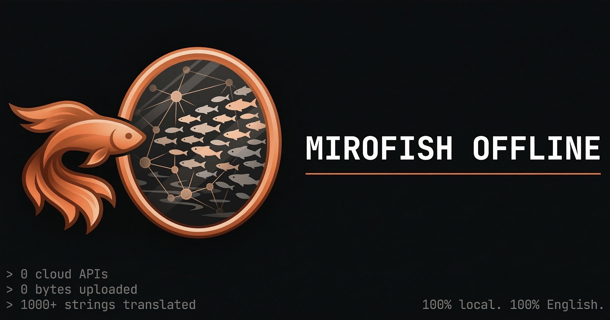

<div align="center">



# Neural Bridge: Future Predictor Edition

**Enterprise-Grade Quantitative AI Forward Predictor.**

*A multi-agent probability engine that ingests historical quantitative data (like stock OHLCV) to predict unwritten future trajectories through adversarial, temporally-anchored Agent debates.*

[](./LICENSE)

</div>

## What is this?

Neural Bridge has been heavily re-architected. It is no longer just a "What-If" social media simulator. It is now a **Deterministic Probability Engine** designed to act like a tier-1 Quant Desk. 

By feeding it historical data (such as financial CSVs), the system mathematically calculates the "Absolute State of Reality" up to the final date provided. It then spawns specialized AI personas (e.g., Retail Traders, Institutional Quants) forced to operate within those strict mathematical boundaries to aggressively debate and predict exactly what will happen *next*. 

The system concludes by extracting a unified consensus prediction of the future.

## The 3-Phase Prediction Pipeline

### 1. The Quantitative Processor
Instead of simply asking an LLM to guess the future from a massive CSV text dump (which natively causes severe VRAM bloat and hallucinations), the backend utilizes a hardened `pandas/numpy` processing layer.
- Automatically calculates historical means, Z-Score deviations (anomalies), volatility regimes, and all-time support/resistance levels.
- Produces a hyper-consolidated **Statistical Data Report** that binds the agents to factual data, effectively banning hallucination.

### 2. The Probability Engine (Multi-Agent Simulation)
The underlying OASIS framework natively spawns up to 15 unique Agents. 
- During the simulation, agents do not rehash the past—they engage in a **Forward-Projection window**.
- A strict **Temporal Anchor** is algorithmically injected per simulated round (e.g., "This is Day 5 of the prediction window"). Agents are forced to stake out and defend forward-looking probabilities against adversarial models.

### 3. The Oracle Consensus Extraction
The simulation itself is merely the computational method to weigh the probabilities.
- At the end of the simulation's lifecycle, the `extract_consensus.py` script automatically scans the immense SQLite database of debated posts.
- It leverages local LLMs (via LM Studio) to distill hundreds of highly accurate, mathematically grounded debates into a pristine, actionable **16-point JSON Prediction Report**.

## Tech Stack

A complete inventory of every runtime dependency the engine touches. All inference is local — nothing leaves the host.

### Backend — Python 3.11+
| Layer | Module | Purpose |
| --- | --- | --- |
| Web framework | `flask` (>=3.0), `flask-cors` (>=6.0) | REST API on port 5001, CORS for the Vite dev server |
| LLM clients | `openai` (>=1.0) | Unified OpenAI-compatible client routed at LM Studio / Ollama |
| | `httpx` (>=0.27) | Service health pre-flight in [backend/run.py](backend/run.py) |
| | `requests` (>=2.28) | Ollama embedding fallbacks and ad-hoc HTTP |
| Graph database | `neo4j` (>=5.15) | Bolt driver for the memory graph |
| Multi-agent sim | `camel-oasis` (==0.2.5) | OASIS social-platform simulator |
| | `camel-ai` (==0.2.78) | Underlying CAMEL agent framework (`ModelFactory`, `ModelPlatformType`, `BaseMessage`) |
| Quant / numerics | `numpy` (>=1.26) | Z-scores, volatility regimes, rolling stats in [market_data_consolidator.py](backend/app/services/market_data_consolidator.py) |
| | `pandas` (>=2.1) | CSV / Excel ingestion + time-series math |
| | `openpyxl` (>=3.1) | Pandas backend for `.xlsx` uploads |
| File parsing | `PyMuPDF` (`fitz`, >=1.24) | PDF text extraction in [file_parser.py](backend/app/utils/file_parser.py) |
| | `Pillow` (>=10.0) | Image decode for the screenshot vision pipeline |
| | `charset-normalizer` (>=3.0), `chardet` (>=5.0) | Encoding detection for non-UTF-8 text |
| Utilities | `python-dotenv` (>=1.0) | `.env` loading |
| | `pydantic` (>=2.0) | Schema validation for ontologies + structured LLM output |
| Dev (optional) | `pytest`, `pytest-asyncio`, `pipreqs` | Test suite + dependency auditing |

**Stdlib hot-path:** `asyncio`, `multiprocessing`, `threading`, `queue`, `signal`, `atexit`, `subprocess`, `sqlite3` (OASIS event log), `dataclasses`, `enum`, `pathlib`, `logging` + `RotatingFileHandler`, `uuid`, `base64`, `tempfile`, `shutil`, `glob`.

### Frontend — Node.js 18+
| Module | Purpose |
| --- | --- |
| `vue` (^3.5) | Composition-API SPA |
| `vue-router` (^4.6) | Client-side routing |
| `axios` (^1.13) | API client in [src/api/index.js](frontend/src/api/index.js), 5-minute timeout for slow LLM calls |
| `d3` (^7.9) | Graph visualisations in [GraphPanel.vue](frontend/src/components/GraphPanel.vue) and step views |
| `vite` (^7.2), `@vitejs/plugin-vue` (^6.0) | Dev server (port 3000) + build, proxies `/api` → `:5001` |
| `concurrently` (^9.1, root) | Runs backend + frontend together via `npm run dev` |

### Infrastructure & local services
- **Neo4j 5.15+ Community** with the APOC plugin — graph store on Bolt `:7687`, browser `:7474`.
- **LM Studio** (preferred on Apple Silicon) or **Ollama** — OpenAI-compatible LLM host on `:1234` (LM Studio) or `:11434` (Ollama).
- **Embedding model:** `nomic-embed-text-v1.5` (768-dim) served on `:1235` by LM Studio, or via Ollama's embeddings endpoint.
- **LLM model:** local Gemma `gemma-4-26b-a4b-it` (default) — see `LLM_MODEL_NAME`. Qwen 2.5 / LLaMA 3 work as drop-ins.
- **Container runtime:** Docker + docker-compose (`neural_bridge`, `neural_bridge-neo4j`, `neural_bridge-ollama` services).
- **Python toolchain:** `uv` (>=0.9) for the locked install path; `pip` works against `requirements.txt`.

### Architectural modules (project source)
- **API blueprints** ([app/api/](backend/app/api/)): `graph.py`, `simulation.py`, `report.py`, `scrape.py` — registered under `/api/{graph,simulation,report,scrape}`.
- **Services** ([app/services/](backend/app/services/)): `ontology_generator`, `graph_builder`, `text_processor`, `entity_reader`, `oasis_profile_generator`, `simulation_manager`, `simulation_config_generator`, `simulation_runner`, `simulation_ipc`, `graph_memory_updater`, `graph_tools`, `market_data_consolidator`, `screenshot_processor`, `report_agent`.
- **Storage** ([app/storage/](backend/app/storage/)): `neo4j_storage`, `neo4j_schema`, `graph_storage`, `embedding_service`, `ner_extractor`, `search_service`.
- **Utilities** ([app/utils/](backend/app/utils/)): `file_parser`, `llm_client`, `logger`.
- **Models** ([app/models/](backend/app/models/)): `project`, `task`.
- **Simulation scripts** ([backend/scripts/](backend/scripts/)): `run_parallel_simulation.py` (local Neural Bridge loop), plus legacy adapter scripts kept for compatibility.

## Quick Start (Local Inference)

### Prerequisites

- macOS / Linux (optimised for Apple Silicon, e.g. M2 Max)
- Python 3.11+, Node.js 18+, Neo4j 5.15+, Docker (optional but recommended)
- Local LLM host (LM Studio or Ollama) running Gemma / Qwen / LLaMA 3
- `uv` (optional, but used by `npm run setup:backend` and the Dockerfile)

### Manual Setup
**1. Start Neo4j**
```bash
docker run -d --name neo4j \
  -p 7474:7474 -p 7687:7687 \
  -e NEO4J_AUTH=neo4j/neural_bridge \
  neo4j:5.15-community
```

**2. Start the Backend**
```bash
# Ensure you are using your configured .env file
cd backend
python -m venv .venv
source .venv/bin/activate
pip install -r requirements.txt   # numpy/pandas/Pillow/httpx/openpyxl now included
python run.py &
```

**3. Start the Frontend**
```bash
cd frontend
npm install
npm run dev &
```

**One-shot alternative** (from the repo root, requires `uv`):
```bash
npm run setup:all   # installs root, frontend, and backend deps
npm run dev         # concurrently boots backend (uv run) + frontend (vite)
```

Open `http://localhost:5173` (or `:3000` under `npm run dev`) to upload your data and trigger the Prediction Engine.

## Configuration (.env)

The pipeline talks directly to your local hardware via OpenAI-compatible API routes:

```bash
# LM Studio / Ollama Configuration
LLM_API_KEY=lm-studio
LLM_BASE_URL=http://localhost:1234/v1
LLM_MODEL_NAME=local-model

# Neo4j Memory Graph
NEO4J_URI=bolt://localhost:7687
NEO4J_USER=neo4j
NEO4J_PASSWORD=neural_bridge
```

## Performance & Optimization

- **Context Constraints:** Because the Quant Processor compresses years of daily data into absolute trajectory statistics (providing only the last 30 raw data rows for immediate momentum memory), token overhead per agent is reduced by ~80%. This prevents the "Lost in the Middle" LLM amnesia and makes the framework highly efficient for local M2/M3 Mac deployment.
- **Topic Agnosticism:** The internal statistical system dynamically adapts to the provided dataset. While optimized for OHLCV financial data, the system relies on agnostic column values rather than hardcoded finance rules—meaning it can just as easily predict weather patterns or algorithmic traffic anomalies.

## License & Attribution
AGPL-3.0. Neural Bridge grew from a legacy local-first simulator and is powered by [OASIS](https://github.com/camel-ai/oasis) from the CAMEL-AI team, heavily modified for deterministic quantitative future prediction instead of generative interaction.
