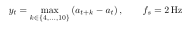
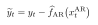
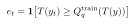

# Methods and Reproducibility

The stable product architecture, the single V-JEPA 2.1/TRIBE v2 upstream stack, the multi-dataset generalist goal, and the current VEATIC 2.1 rebuild position are defined in the root [`README.md`](../README.md). This page owns evaluation and reproducibility details rather than a second product description.

## What the inputs are

The VEATIC Neural Bridge input is one sealed consolidated folder:
`/Volumes/onn. Drive/Neural Bridge Artifacts/features/veatic-2.1/neural-bridge-input/`.
Its 124 per-video directories contain the final TRIBE `cortical_prediction` payload and the
matching authoritative `rows.csv` plus only small allowlisted alignment metadata. The
assembler verifies every source/destination hash and row mapping. V-JEPA hidden-state arrays
are never copied or opened and are not a second candidate input. The cortical values are
predictions generated from video, not measurements from the viewers represented by VEATIC or
AGAIN.

VEATIC 2.1 is at fresh Phase 00. The current work first proves exact 124-video per-folder row
identity, input completeness, schema, finiteness, and the hidden-state firewall. Target
windows, washout gaps, threshold quantiles, history depths, grouped/blocked partitions,
projection widths, model families, and seed counts are then derived from VEATIC evidence in
later phases. None is inherited from AGAIN or from an earlier VEATIC 2.1 attempt.

The AGAIN feature foundation uses the frozen [V-JEPA 2.1](https://arxiv.org/abs/2603.14482) ViT-G target encoder and [TRIBE v2](https://arxiv.org/abs/2605.04326). The primary affect sources are the [AGAIN dataset](https://doi.org/10.1109/TAFFC.2022.3188851) and [VEATIC](https://openaccess.thecvf.com/content/WACV2024/html/Ren_VEATIC_Video-Based_Emotion_and_Affect_Tracking_in_Context_Dataset_WACV_2024_paper.html). AGAIN provides first-person continuous arousal annotations; VEATIC provides continuous ratings of a selected character's perceived affect. Results are therefore reported as a cross-dataset evidence ladder, not as a single transferred model or identical label construct.

## Formal prediction target

For the concluded AGAIN Phase 7 study, at its 2 Hz row rate, the future-movement quantity was



so its forecast window was 2–5 seconds ahead. These row offsets and seconds are not VEATIC 2.1 candidates by inheritance. Fresh VEATIC target windows must be derived from VEATIC label dynamics before cortical scoring. AGAIN Phase 7 predicts



after fixing the autoregressive residualizer from its declared training ownership. Event labels use



so test labels never choose their own threshold.

- **Spearman** is rank correlation between the true and predicted continuous target.
- **Top-5% lift** is the mean true future movement among valid held-out rows ranked in the top 5%, minus the overall held-out-row mean.
- **Event PR-AUC** is average precision pooled over valid held-out rows, retaining valid negatives from zero-event videos.

## Evaluation rules

- Use every eligible dense 2 Hz row and retain valid negatives from zero-event videos.
- For fresh VEATIC, retain every Phase-00-verified canonical row in the primary substrate.
  Black/static quality flags are metadata and nuisance controls; any filtered analysis is a
  separately registered sensitivity with matched lanes.
- Fit PCA, scalers, thresholds, AR models, and heads inside their allowed training folds only.
- Train `AR-only` separately. Reuse the exact fold/seed frozen AR unchanged in real and matched-control residual lanes.
- Pool event PR-AUC over valid rows; never invent per-video zero scores.
- Keep blocked-temporal and held-out-video evidence distinct.
- Separate exploration, candidate freeze, fresh confirmation, and outer closure.
- Treat shuffled, random, video-mean, diagnostic-only, and label-permutation lanes as scientific controls, not decoration.
- Declare checkpoint ensembles before confirmation; never select ensemble members on the locked result.

“Causal temporal” means that inputs are restricted to information available at prediction time. It does not mean the study identifies a causal effect of video content on arousal.

## Evaluation unit and uncertainty

The dense 2 Hz rows within a video are serially dependent and are not presented as independent experimental replicates.

- The concluded AGAIN Phase 7 study used five outer folds grouped by `video_id`, nine fresh seeds, and three prespecified checkpoint groups. Its `420/420` count is an evaluation matrix (`315` member + `105` ensemble cells); the consistency result is `15/15` positive fold-checkpoint groups. None of those counts or settings transfers to VEATIC 2.1.
- The locked video-only study uses a prospectively untouched 299-video pool. Its paired uncertainty procedure resamples whole videos for `2,000` bootstrap replicates; all three one-sided 95% lower bounds for the gain over the strongest control are positive.
- Grouped-video evaluation holds out video IDs, not necessarily participant identities. No participant-exclusive or external-dataset generalization claim is made.

## Portable verification

The tracked closure evidence can be checked on ordinary CPU hardware:

```bash
uv sync --group dev
uv run ruff check src tests
uv run ty check
uv run pytest -q

uv run python -m neural_bridge.again verify-evidence phase5-selected \
  --root studies/again/phase-05-learned-bridge/evidence/phase_5_5_selected_head_420_confirmation_20260714_124953
uv run python -m neural_bridge.again verify-evidence phase7-blocked \
  --root studies/again/phase-07-continuous/blocked-confirmation
uv run python -m neural_bridge.again verify-evidence phase7-grouped \
  --root studies/again/phase-07-continuous/grouped-confirmation
uv run python -m neural_bridge.zero_label \
  studies/again/zero-label/locked-confirmation
```

Historical member checkpoints can also be replayed through `python -m neural_bridge.again replay-checkpoint` when the registered external dense, PCA, and run roots are available.

## Hardware support

The concluded shared learned-head implementation supports PyTorch on CPU or CUDA and MLX on
Apple silicon. Fresh VEATIC implementation is rebuilt separately and benchmarks safe CPU,
MLX-concurrency, GPU-batch, and CPU/GPU pipeline configurations on the actual Mac Studio
before every material main run. Evidence verification and historical MLX checkpoint replay
do not require MLX hardware. Project commands use standard `uv`, Python, and pytest.

## Heavy artifacts

Large caches, fitted PCA, checkpoints, score arrays, and model weights live only under `/Volumes/onn. Drive/Neural Bridge Artifacts`. MLflow tracks registered experiment results from that root. Repository documentation must use the exact external paths; no local artifact alias is authoritative.

## Claim discipline

Only prospectively declared confirmation promotes canonical claims. Grouped held-out-video and blocked-temporal protocols answer different generalization questions, so each stands on its own evidence. Exact-value, external-generalization, medical, mind-reading, and production claims require separate confirmation.
